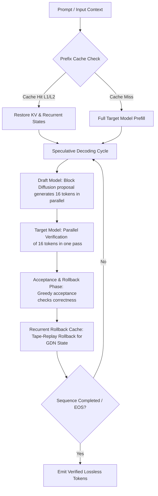

<div align="center">
  <h1>⚡ dflash ⚡</h1>
  <p><strong>DFlash Speculative Decoding Engine optimized for Apple Silicon (MLX)</strong></p>

  <p>
    <a href="https://arxiv.org/abs/2602.06036"></a>
    
    
    
    
  </p>
</div>

---

**dflash-mlx** is a high-performance speculative decoding implementation of **DFlash (Block Diffusion for Flash Speculative Decoding)** specifically optimized for macOS and Apple Silicon using the MLX framework.

By generating a proposal block of 16 tokens in parallel from a lightweight draft model (~1B parameters) and verifying it in a single forward pass through a larger target model, `dflash-mlx` delivers up to **4.3x speedups** on modern Apple Silicon hardware. Most importantly, the output is **lossless**—every emitted token is validated against the target model's greedy argmax before it is committed.

---

---

## 🗺️ How it Works & Architecture

The speculative decoding loop combines parallel draft proposal generation, target verification, and a specialized state rollback mechanism to speed up text generation.



1. **Parallel Draft Proposal**: A small, fast draft model predicts a block of 16 tokens in parallel using block diffusion.
2. **Target Verification**: The target model evaluates all 16 tokens in a single forward pass.
3. **Greedy Acceptance**: The system keeps the longest prefix matches between the draft and the target model, discarding rejected trailing tokens.
4. **Lossless Guarantee**: Every emitted token matches the target model's exact greedy argmax at verification time. No unverified draft tokens are ever output.

---

## 🛠️ Technical Deep Dive & Optimizations

`dflash-mlx` achieves state-of-the-art inference speeds on Apple Silicon by combining MLX-native components with custom hardware-optimized Metal kernels.

### 1. Tape-Replay Rollback (Recurrent State Management)
Traditional speculative decoding requires snapshotting and restoring the entire model state at every block step, which degrades memory bandwidth on large models.
* For **GatedDeltaNet (GDN)** targets, `dflash-mlx` records an *innovation tape* during target verification.
* In the rollback phase, it replays only the accepted tokens through a custom Metal kernel, restoring the state in $O(\text{accepted})$ time instead of duplicating full recurrent matrices.

### 2. Verify-Specialized Quantized GEMM (`verify_qmm`)
Verification processes blocks of size $M = 16$. This specific matrix-multiplication shape dominates target execution time, particularly with 4-bit quantized models.
* `dflash-mlx` features a custom Metal SIMDgroup-level Matrix Multiply-Accumulate (MMA) kernel (`verify_qmm`).
* Includes two specialized, shape-adaptive variants:
  * `mma2big`: Optimized for dense targets.
  * `mma2big_pipe`: Leverages split-K reduction and double-buffered staging to maximize threadgroup utilization for large Mixture of Experts (MoE) targets.
* Automatically engaged for MoE architectures and dense models with $\ge 40$ layers.

### 3. Tiered Prefix Cache Hierarchy (L1 + L2 SSD Spill)
To eliminate redundant prefill overhead in multi-turn dialogues and repeated benchmark requests:
* **L1 Cache (RAM)**: Captures snapshots of target KV caches, GDN recurrent states, last hidden states, and logits.
* **L2 Cache (SSD Spill)**: Automatically offloads inactive snapshots to disk, reclaiming GPU memory under high-context workloads.
* Budget-based controls allow setting exact byte sizes and automatic eviction policies.

### 4. Target-Owned Attention Routing
Adapters for architectures like Qwen and Gemma route validation blocks through the appropriate MLX or Grouped Query Attention (GQA) reshape paths internally. This keeps the public CLI interfaces simple and free of manual attention-kernel toggle flags.


## ⚙️ Installation

Install the stable release via `pip`:

```bash
pip install dflash-mlx
```

If you wish to run benchmarks and require dataset downloads, install with the optional benchmark dependencies:

```bash
pip install "dflash-mlx[bench]"
```

---

## 🚀 Quick Start Guide

### 1. One-Shot Local Generation
Run inference directly from the terminal. The draft model registry automatically identifies and downloads the correct draft model for registered targets:

```bash
PROMPT="Explain the significance of Euler's identity in mathematics. Reason step-by-step."

dflash generate \
  --model Qwen/Qwen3.5-9B \
  --prompt "$PROMPT"
```

### 2. OpenAI-Compatible API Server
Spawn a high-throughput OpenAI-compatible server. This is fully compatible with developer tools like `aider`, `Continue`, `Open WebUI`, `LM Studio`, and custom API clients:

```bash
dflash serve \
  --model mlx-community/Qwen3.6-27B-4bit \
  --draft z-lab/Qwen3.6-27B-DFlash \
  --port 8000
```

Query the streaming completion endpoint using `curl`:

```bash
curl http://127.0.0.1:8000/v1/chat/completions \
  -H "Content-Type: application/json" \
  -d '{
    "model": "mlx-community/Qwen3.6-27B-4bit",
    "messages": [{"role": "user", "content": "Explain Euler identity."}],
    "max_tokens": 1024,
    "stream": true
  }'
```

### 3. Canonical Local Benchmark
Validate DFlash speedups compared to stock MLX on your own local Apple Silicon GPU:

```bash
dflash benchmark \
  --model Qwen/Qwen3.5-9B \
  --prompt "Write a Python script that calculates prime numbers using a sieve." \
  --max-tokens 1024 \
  --repeat 3 \
  --cooldown 60 \
  --no-eos
```

---

## 📈 Server Observability & Metrics

When running `dflash serve`, real-time performance diagnostics are exposed at the `/metrics` endpoint:

```bash
curl http://127.0.0.1:8000/metrics
```

### Key Prometheus Metrics Explained:
* `prefill_tok_s_physical`: The true generation rate of tokens physically computed on the GPU after prefix-cache restoration.
* `prefill_tok_s_restored`: The virtual token throughput calculated from prefix cache hits over the prefill wall time.
* `prefill_tok_s_apparent`: The logical prefill speed experienced by the user.
* `rates.average_decode_tok_s`: The average decoding speed since server boot.
* `rss_gb` / `wired_gb`: Resident and wired RAM footprint tracking.
* `tokens_per_cycle` / `cycles`: Tracking of speculative cycle dynamics, signaling when context lengths or formatting collapse speculative decoding effectiveness.

---


```bash
# Query the local registry directly from the command line
dflash models
```

---

## 🛠️ Advanced Server Configurations & Tunning

Tune memory allocation, cache policies, and pipeline performance using optional CLI parameters:

```bash
# Force target-only autoregressive decoding for very short sequences (saves draft overhead)
dflash serve --model Qwen/Qwen3.5-9B --fastpath-max-tokens 64

# Set maximum prefill batch size for long context sequences
dflash serve --model Qwen/Qwen3.5-9B --prefill-step-size 8192

# Enable detailed server logging and cache statistics
dflash serve --model Qwen/Qwen3.5-9B --diagnostics basic

# Enable full profiling (includes GPU memory waterfall analysis and cycle timings)
dflash serve --model Qwen/Qwen3.5-9B --diagnostics full

# Allocate memory limits and spill targets for tiered Prefix Snapshots
dflash serve --model Qwen/Qwen3.5-9B \
  --prefix-cache-max-entries 4 \
  --prefix-cache-max-bytes 4GB \
  --prefix-cache-l2 \
  --prefix-cache-l2-dir .artifacts/dflash/l2 \
  --prefix-cache-l2-max-bytes 50GB
```

---

## 💻 Developer Guide & Testing

If you are developing features for `dflash-mlx` or porting new model architectures:

### 1. Doctor Utility
Run environment and configuration verification tools:
```bash
dflash doctor
```

### 2. Unit Testing
Execute the complete test suite using `pytest`:
```bash
pytest tests/
```

### 3. Adding New Model Architectures
To introduce support for a new model family:
1. Define model-specific state layouts and attention masks.
2. Implement KV cache trimming and rollback policies.
3. Validate logits output parity against reference implementations using pytest integration tests (e.g., `tests/test_sdpa_parity.py`).


